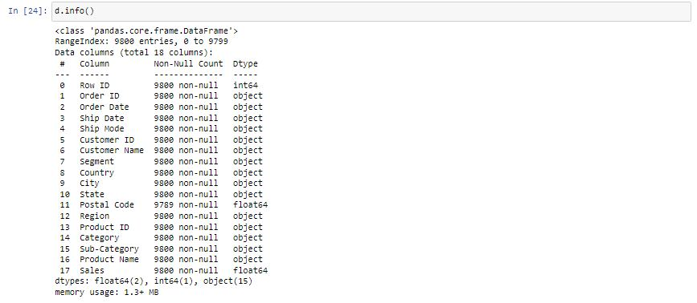

# Ex03-Univariate-Analysis

# Aim
To read the given data and perform the univariate analysis with different types of plots.
 
# Explanation
Univariate analysis is basically the simplest form to analyze data. Uni means one and this means that the data has only one kind of variable. The major reason for univariate analysis is to use the data to describe. The analysis will take data, summarise it, and then find some pattern in the data.
    
# Algorithm

## Step1
Read the given data.
    
## Step2
Get the information about the data.
    
## Step3
Remove the null values from the data.

## Step4
Mention the datatypes from the data.
    
## Step5
Count the values from the data.
    
## Step6
Do plots like boxplots,countplot,distribution plot,histogram plot.
    
# Program
```
Developed by        : Venkatesh E
Registration Number : 212221230119
```
```
import pandas as pd
import numpy as np
import seaborn as sns

d=pd.read_csv('superstore.csv')
d

d.head()
d.info()
d.describe()
d.isnull().sum()

d.dtypes

d['Postal Code'].value_counts()

sns.boxplot(x='Postal Code', data=d)
sns.countplot(x='Postal Code',data=d)
sns.distplot(d["Postal Code"])
sns.histplot(x='Postal Code',data=d)
```

# Output





# Result
Thus we have read the given data and performed the univariate analysis with different types of plots.


    
